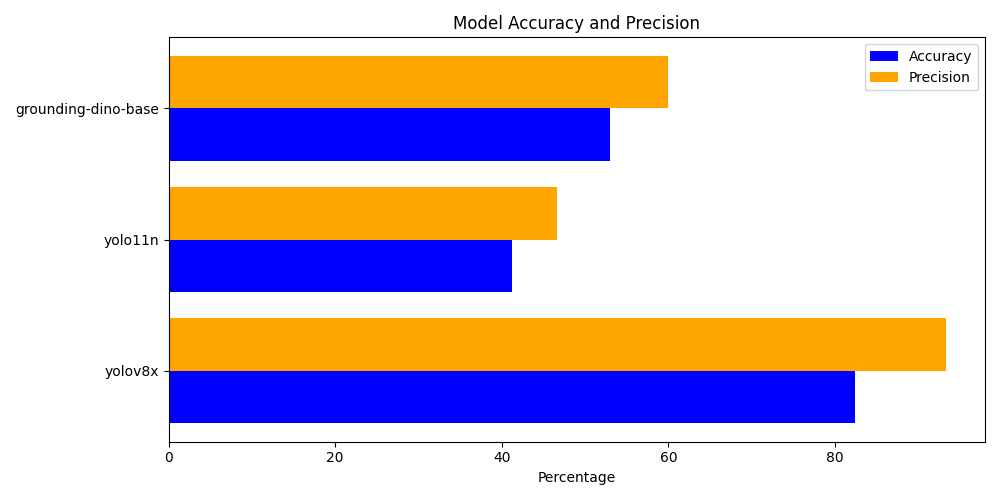
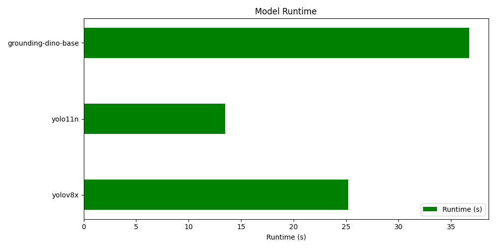
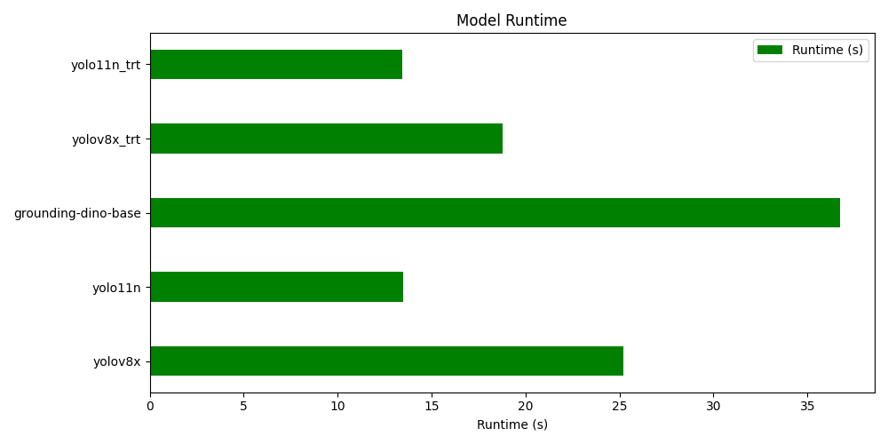
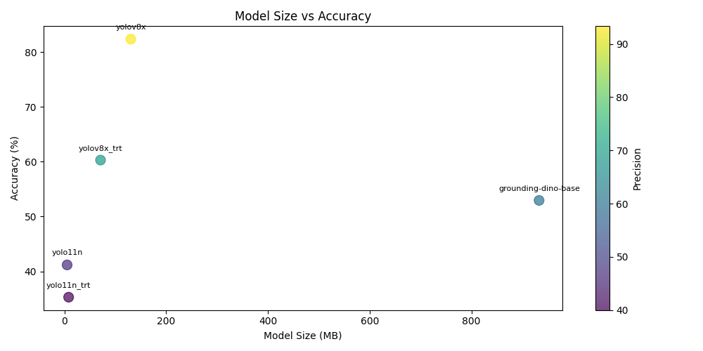

## 258HW2

**Author:** Honghao Ma

---

### Overview

In this assignment, I first test three different models, which is yuolo11n,yolov8x, IDEA-Research/grounding-dino-base. As the first test result, we can see that model yolov8x has best result of Accuracy and precision. Yolo11n has best runing time. Below are the results of the first run.

So I decided to choose yolov8x and yolo11n to apply acceleration optimization. Since I am using NVIDIA 4070s GPU, so I choose to use TensorRT to quantize these two models to int 8. After converting them to the TensorRT format, the running speed was improved. yolov8x was reduced in size by 45%, but yolo11n actually increase by 55%, but both of their accuracy was reduced due to the quantization of them by TensorRT. Below are the updated graph after the second run.

In conlcusion, From the quantized results we can see that the accuracy of both models has decreased, but yolov8x quantized accuracy is still higher than yolo11n unquantized results. Since we observed an increase in the size of yolo11n's model after quantization, we thought that perhaps the model itself had been quantized. So the re-quantization resulted in an increase in the model size. But our quantization is very successful on yolov8x. Even after quantization yolov8x still outperforms the other models we tested. Finally, we also plotted the results of model volume vs. accuracy in a point chart. It can be seen that in the same yolo model, the accuracy decreases as the volume decreases.

