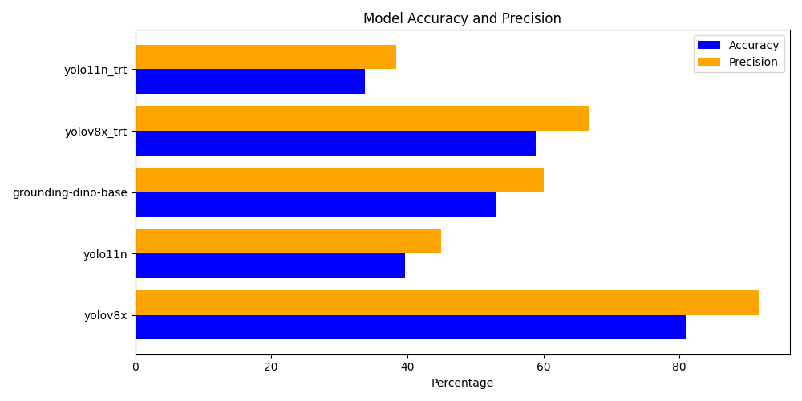
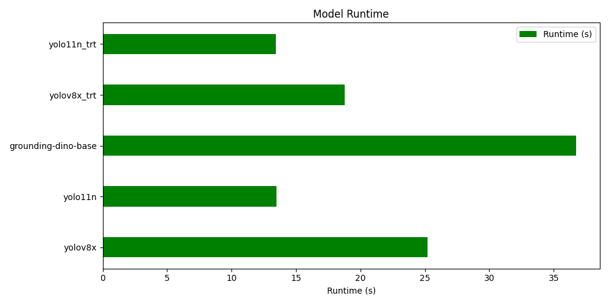
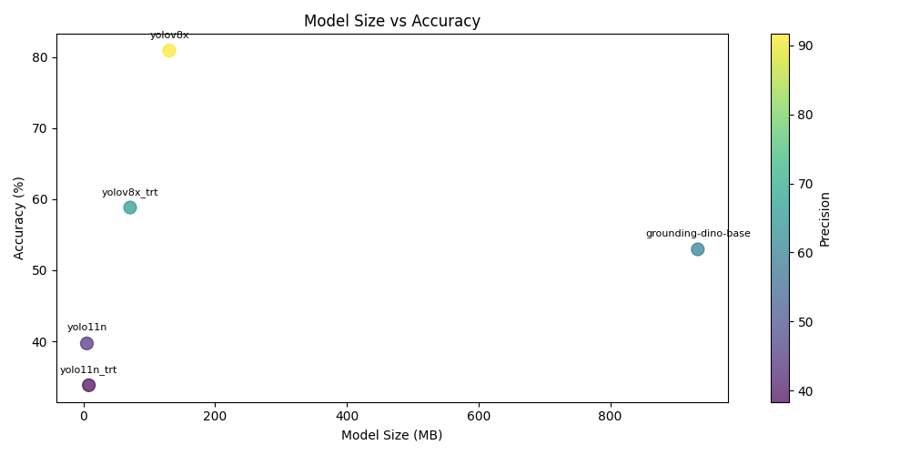

## 258HW2

**Author:** Honghao Ma

---

### Overview

To be write

---

### Getting Started

1. **Clone the Repository**

```
git clone https://github.com/MarlonMa17/258HW2.git
```

2. **Navigate to the Project Directory**

```
cd 258HW2/main
```

3. **Run the Code**
    - Follow instructions in the assignment files or code comments for running specific scripts.

---

### Requirements

- Python 3.x (or the language specified in assignment files)
- Any additional dependencies will be listed in the relevant code files

--- 

### Result


#### Model Accracy and Precision Compare



#### Model Run Time Compare



#### Model Size vs Accuracy


